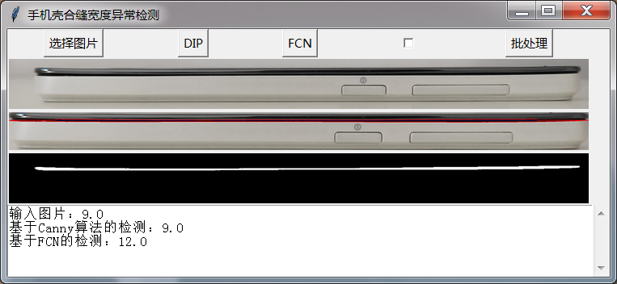

# FCN-phone-surface-joints-width-detection
Detect the mobile phone surface seams width defects.  Based on  fully convolutional network and digital image process.
## Problem
- Input: An image containing the appearance of a phone.
- Output: The maximum width of the phone surface seams.
## Methods
### Based on Canny algorithm
Flow chart of Detection<br>

### Based on fully convolutional network
## Requirements
```Recommended to use conda to configure a virtual environment.```
- Python 3.x
- Tensorflow >= 1.13.1, Tensorflow-gpu >= 1.13.1
- Numpy 1.16.1
- Scipy==1.2.1
- Scikit-image
- Pillow 6.0.0
- Matplotlib
## Content
- ```FCN_DatasetReader.py```: Classes for training dataset and test image reading
- ```FCN_layers.py```: Functions of layers
- ```FCN_model.py```: Model of FCN
- ```FCN_finetune.py```: Main training and test of FCN
- ```resnet.py```and```config.py```: Resnet backbone
- ```data/data200/*```: Dataset,200 images. the subfolder are image and annotation.
- ```data/data3500/*```: Dataset by image augmentation. index_test.txt, index_train.txt and index_valid.txt are testing set, training set and validation set respectively.
They are randomly generated proportionally by index.py.
- ```logs```: Folder for training logs
- ```checkpoints```: Folder for model parameters
- ```test```: Folder for test images
- ```gui_detect.py ```: GUI program.
- ```tmp ```: Temporary storage.
- ```Dissertation.pdf```: The dissertation of this project.
## Usage
### GUI program
Run directly. To use FCN prediction, you need to download the pre-trained model first.
- Click the ```选择图片``` button to choose a image file.
- Click the ```DIP``` button to detect based on Canny algorithm, click the ```FCN``` button to detect based on FCN.
- Click the ```批处理``` button for batch detection. Batch detection uses the Canny algorithm by default, select the check box to use the FCN method.

### Train and finetune
## Results


## Code Reference
- https://github.com/OnionDoctor/FCN_for_crack_recognition
- https://github.com/ry/tensorflow-resnet
## TODA
- Test the Semantic segmentation SOTA network  DeepLab v3+ and the classic network U-Net.
- Make the model more accurate and faster.
